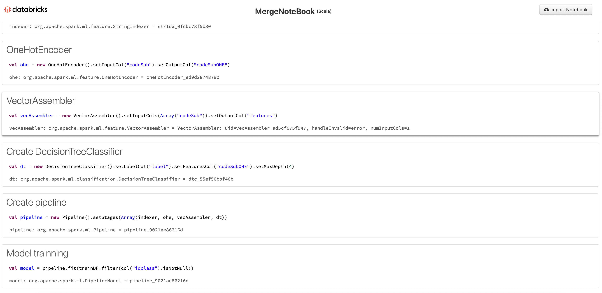

# Data Analyst & Backend Developer

#### Technical Skills: Python, SQL, Microsoft SQL Server, Power BI, Spark, Hadoop, Excel, MongoDB, Scala, AlteryX, Databricks, Java

## Education
- **Master 2 in Software, Data Engineering**  Gustave Eiffel University - Gaspard Monge Institute at Paris (_2021-2023_)
- **Bachelor's Degree in Mathematics and Computer Science**  Gustave Eiffel University - Gaspard Monge Institute at Paris (_2017-2021_)

## Work Experience
**IT Project Manager & Software Developer Traineeship @ McDonald’s France Services (_December 2021 - September 2023_)**
- Led the implementation of a web-based MVC project tracking and management tool using C# ASP.NET.
- Oversaw and guided various phases of application development.
- Designed and developed an architecture focused on project management, tracking, and automation.
- Defined user journeys, technical specifications, and agile backlog management to effectively address priority needs.
- Established a project timeline and allocated resources to meet deadlines.
- Contributed to technical development, including database structuring and the creation of the C# ASP.NET MVC web application.
- Managed project versions using TFS within a Microsoft Visual Studio environment.
- Utilized a technology stack including C#, jQgrid, jQuery, ASP.NET, Trello, CSS, and HTML.

**Data Analyst Intern @ Iziwork (_June 2021 - September 2021_)**

- Managed ETL (Extract, Transform, Load) processes and performed data analysis within a NoSQL database.
- Conducted a feasibility study on integrating a variable into a matching formula within a machine learning model.
- Extracted data from a NoSQL database.
- Created a Python module to visualize user data on the map of France.
- Retrieved data from openData regarding GPS coordinates of French regions and associated it with our data.
- Collected data from APIs such as TravelTime or Google Maps concerning travel times.
- Visualized accessible geographic areas from point A within a given travel time via the TravelTime API in the form of isochrones.
- Applied a linear algorithm to a large volume of data to ensure performance.
- Analyzed and assessed the feasibility of applying this algorithm to a large data volume.
- Conducted a financial evaluation of this module in terms of API usage and cost per query.
- Documented this module using MkDocs.
- Presented this study to discuss with the data team the impact of integrating this variable into the machine learning model formula.

**Technical Environment**: DOCKER, PYTHON, MONGODB, JUPYTER NOTEBOOK, VISUAL STUDIO CODE, TRAVELTIME API, GOOGLE API, GITHUB, JIRA

## Projects
### ETL Project @ Gustave Eiffel University Paris 2023
[Link to the databricks notebook](https://databricks-prod-cloudfront.cloud.databricks.com/public/4027ec902e239c93eaaa8714f173bcfc/4475201351668581/4017966511050725/7429548704676706/latest.html)

- Conducted an in-depth study of data related to medications available on the French market.
- Managed and processed data, including preparation and integration, to ensure their consistency and relevance for analysis (using Databricks).
- Trained machine learning algorithms on this data, followed by a detailed visualization of the obtained results.

### Creation of a Comprehensive Recap Training in Python, SQL, and Java
[Python](https://github.com/Gogo-IGM-BK/Python-Data) | [SQL](https://github.com/Gogo-IGM-BK/SQL) | [Java](https://github.com/gogosmo/Java-Backend)

Throughout my journey, I have developed a comprehensive training program that summarizes my knowledge and skills in Python, SQL, and Java. This training covers the essential aspects of these programming and data management languages.

- Python: I have delved deep into Python's capabilities, including data analysis, data manipulation, charting, and implementing machine learning algorithms using libraries like Pandas, NumPy, Matplotlib, and Scikit-Learn.

- SQL: I have mastered SQL queries to interact with relational databases, efficiently extracting and processing data for in-depth analyses.

- Java: I have gained strong expertise in Java development, working on software projects and using object-oriented programming concepts to create robust and scalable applications.

This recap training aims to share my knowledge and assist other professionals in gaining a thorough understanding of these languages and their practical applications.

Feel free to reach out to me to learn more about this training or to discuss its details.

### UGEOverFlow Project @ Gustave Eiffel University Paris 2023

- As part of the UGEOverFlow project at Gustave Eiffel University in 2023, we developed a university alternative to StackOverflow for the University.

- This project involved designing a web application based on the MVC architecture using the Spring framework, with the integration of Spring Data, Spring MVC, and Spring Security modules.

- We implemented Thymeleaf for template management and complemented it with the use of JavaScript and jQuery for client-side dynamics.

- Additionally, we adopted Hibernate as an Object-Relational Mapping (ORM) for optimized interaction with the H2 database, which served for data storage and management.

- The project aimed to address the specific needs of the university by providing a question-and-answer platform tailored to its academic and research requirements.

